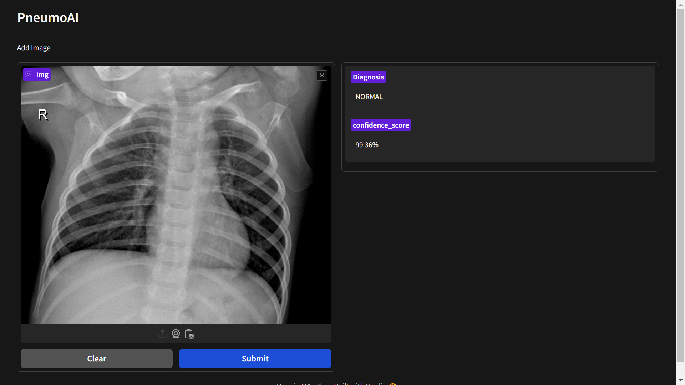

<div align="center">
  <h1>Pulmonary Infection Detection using Deep Learning</h1>
</div>
<div align="center">
  
</div>


This project aims to classify lung images to determine whether a person is suffering from pneumonia or not. The classification model is built using deep learning techniques, and a Gradio interface is provided for easy interaction and testing.

<br>

## Run Locally

Clone the project

```bash
   git clone https://github.com/Tejas911/Pneumonia-CNN
```


### Requirements 

Install requirements 

```bash
  pip install -r requirements.txt
```
#### Open Jupyter Notebook:
Launch Jupyter Notebook using the following command:

```bash
  jupyter notebook
```
### Access the Notebook:
Open the 'main.ipynb' file in the Jupyter Notebook interface and try the model using Gradio Interface 

<br>

## Xception Model Overview:

The Xception model, a deep convolutional neural network, excels in feature extraction for image classification:
<div align="center">
  
</div>


- **Depthwise Separable Convolutions:** Reduces computations by separating depthwise and pointwise convolutions.
- **Entry, Middle, and Exit Flows:** Sequential blocks for effective feature learning.
- **Efficiency and Performance:** Optimized design for high accuracy with reduced parameters.

<br>

## Screenshots
<div align="center">
  
</div>
<div align="center">
  
</div>

<br>

## Dataset 

You can access the dataset using this  url -
https://www.kaggle.com/datasets/paultimothymooney/chest-xray-pneumonia


  


